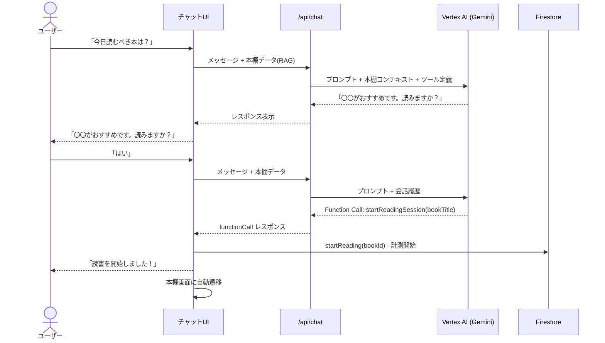
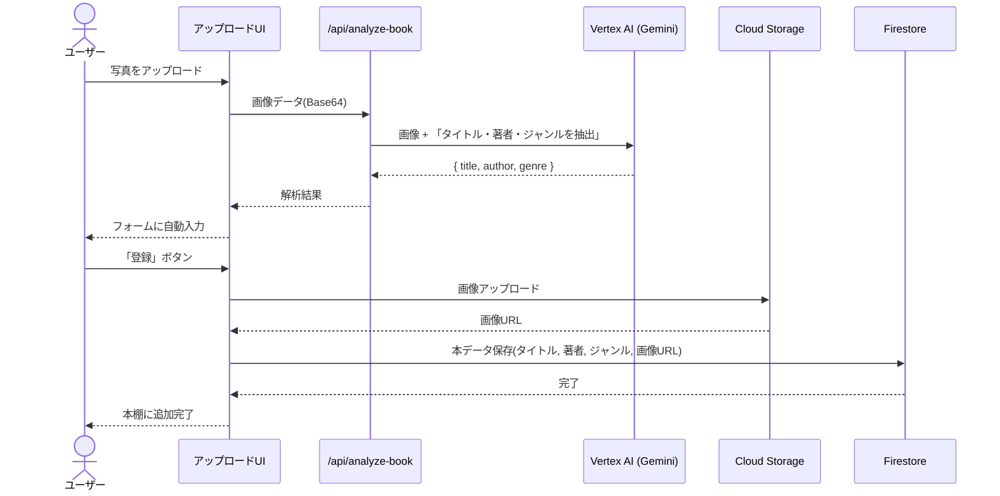
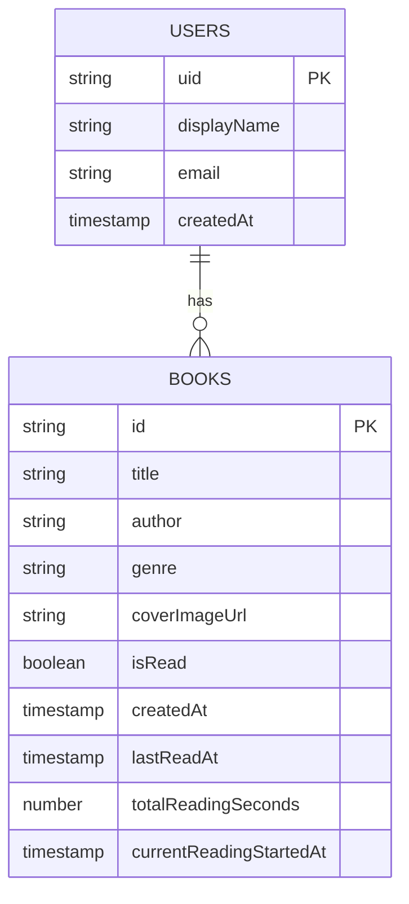

# 読書AIエージェント

写真をアップロードするだけで本を登録し、AIがおすすめの本を提案してくれる読書管理アプリです。

## 機能

- 写真から本のタイトル・著者・ジャンルを自動抽出（Vertex AI）
- AIチャット機能（本棚の情報をRAGとして活用）
- 読書時間の計測（開始/終了ボタンで秒単位で記録）
- AIエージェントによる読書開始（チャットで「読みます」と答えると自動で計測開始）
- 読了/未読の管理（積読管理）
- 本の詳細編集・削除機能

## 技術スタック

| カテゴリ | 技術 |
|---------|------|
| フレームワーク | Next.js 16 (App Router) |
| UI | React 19, Tailwind CSS, shadcn/ui |
| AI | Vertex AI (Gemini 2.5 Flash) |
| インフラ | Google Cloud Run |
| 認証 | Firebase Authentication (Identity Platform) |
| データベース | Cloud Firestore |
| 画像ストレージ | Cloud Storage for Firebase |

## アーキテクチャ

### システム全体図

```mermaid
graph TB
    subgraph Client["クライアント (Browser)"]
        A[スマホ / PC]
    end

    subgraph CloudRun["Google Cloud Run"]
        B[Next.js 16 App Router]
        B --> C["/api/analyze-book<br/>画像解析API"]
        B --> D["/api/chat<br/>AIチャットAPI"]
    end

    subgraph GCP["Google Cloud Platform"]
        E[(Cloud Firestore<br/>ユーザー・本データ)]
        F[(Cloud Storage<br/>本の表紙画像)]
        G[Vertex AI<br/>Gemini 2.5 Flash]
    end

    subgraph Auth["認証"]
        H[Firebase Authentication<br/>Identity Platform]
    end

    A <-->|HTTPS| B
    A -->|Google ログイン| H
    B --> E
    B --> F
    C -->|画像 + プロンプト| G
    D -->|本棚データ(RAG) + 会話履歴| G
```

### AIチャット処理フロー



### 本の登録フロー



### データモデル



## AI機能

### 1. 画像解析（本の登録）

- **エンドポイント**: `/api/analyze-book`
- **モデル**: Gemini 2.5 Flash
- **機能**: アップロードされた本の写真からタイトル・著者・ジャンルを抽出
- **認証**: Google Auth Library（ローカル/Cloud Run両対応）

### 2. AIチャット（RAGベース + Function Calling）

- **エンドポイント**: `/api/chat`
- **モデル**: Gemini 2.5 Flash
- **機能**: 
  - ユーザーの本棚データをコンテキストとして、読書に関する質問に回答
  - Function Callingで読書開始を自動実行
- **RAGデータ**: Firestoreに保存された本の情報（タイトル、著者、ジャンル、読了状態、読書時間、最終読書日）
- **認証**: Google Auth Library（ローカル/Cloud Run両対応）

#### チャット例
- 「今日読むべき本は？」→ 提案後「読みますか？」と確認
- 「はい」「読みます」→ 自動で読書開始＆本棚画面に遷移
- 「最近登録した本は？」
- 「積読になっている本は？」

#### Function Calling

| ツール名 | 説明 |
|---------|------|
| `startReadingSession` | 読書を開始し、本棚画面に遷移 |

## データ構造

### Firestore

```
users/{userId}
├── displayName, email, createdAt
└── books/{bookId}
    ├── title: string
    ├── author: string
    ├── genre: string
    ├── coverImageUrl: string
    ├── isRead: boolean
    ├── createdAt: timestamp
    ├── lastReadAt: timestamp          // 最終読書日時
    ├── totalReadingSeconds: number    // 合計読書時間（秒）
    └── currentReadingStartedAt: timestamp  // 読書中の開始時刻（null=読書中でない）
```

## 環境変数

### クライアント用（.env.production）

```env
NEXT_PUBLIC_FIREBASE_API_KEY=your_api_key
NEXT_PUBLIC_FIREBASE_AUTH_DOMAIN=your_project.firebaseapp.com
NEXT_PUBLIC_FIREBASE_PROJECT_ID=your_project_id
NEXT_PUBLIC_FIREBASE_STORAGE_BUCKET=your_project.firebasestorage.app
```

## GCPセットアップ

### 1. 有効化が必要なAPI

- Identity Platform API
- Cloud Firestore API
- Cloud Storage API
- Vertex AI API
- Cloud Run API
- Cloud Build API
- Artifact Registry API

### 2. Firebaseコンソールでの設定

1. GCPプロジェクトをFirebaseに追加
2. Authentication > Google プロバイダを有効化
3. Firestore Database を作成
4. Storage を作成

### 3. セキュリティルール

**Firestore:**
```javascript
rules_version = '2';
service cloud.firestore {
  match /databases/{database}/documents {
    match /users/{userId} {
      allow read, write: if request.auth != null && request.auth.uid == userId;
    }
    match /users/{userId}/books/{bookId} {
      allow read, write: if request.auth != null && request.auth.uid == userId;
    }
  }
}
```

**Cloud Storage:**
```javascript
rules_version = '2';
service firebase.storage {
  match /b/{bucket}/o {
    match /users/{userId}/books/{allPaths=**} {
      allow read, write: if request.auth != null && request.auth.uid == userId;
    }
  }
}
```

## ローカル開発

```bash
# 依存関係のインストール
npm install

# 環境変数の設定
cp .env.example .env.local
# .env.local を編集

# Vertex AI用のGoogle認証（初回のみ）
gcloud auth application-default login

# 開発サーバー起動
npm run dev
```

### ローカルでのVertex AI認証

ローカル環境でAI機能（画像解析・チャット）を使用するには、`gcloud auth application-default login` を実行してGoogle Cloud認証を設定する必要があります。Cloud Run環境ではサービスアカウントが自動的に使用されます。

## デプロイ

### Cloud Run へのデプロイ

```bash
# GCPプロジェクトを設定
gcloud config set project your_project_id

# デプロイ
gcloud run deploy book-ai-app \
  --source . \
  --region asia-northeast1 \
  --allow-unauthenticated
```

### デプロイ後の設定

1. **Identity Platform** > 設定 > セキュリティ > 承認済みドメインにCloud RunのURLを追加
2. **OAuth認証情報** > 承認済みのJavaScript生成元にCloud RunのURLを追加

## ディレクトリ構成

```
/
├── app/
│   ├── api/
│   │   ├── analyze-book/    # Vertex AI 画像解析API
│   │   └── chat/            # AIチャットAPI（RAG + Function Calling）
│   ├── globals.css
│   ├── layout.tsx
│   └── page.tsx
├── components/
│   ├── ui/                  # shadcn/ui コンポーネント
│   ├── ai-suggestion.tsx    # ホーム画面のAI提案UI
│   ├── book-detail-modal.tsx # 本の詳細・編集モーダル
│   ├── book-list.tsx        # 本棚一覧（読書時間計測機能付き）
│   ├── chat-view.tsx        # チャット専用ページ
│   ├── dashboard.tsx        # メイン画面
│   ├── login-screen.tsx     # ログイン画面
│   ├── profile-view.tsx     # プロフィール
│   └── upload-modal.tsx     # 本の登録モーダル
├── lib/
│   ├── auth-context.tsx     # 認証コンテキスト
│   ├── firebase.ts          # Firebase初期化
│   ├── firestore.ts         # Firestore操作
│   └── storage.ts           # Cloud Storage操作
├── Dockerfile
├── .dockerignore
├── .gcloudignore
└── .env.production          # 本番用環境変数（要作成）
```

## 画面構成

| タブ | 説明 |
|-----|------|
| ホーム | 統計情報、AIへの質問サジェスト |
| 本棚 | 本の一覧、読書開始/終了、読了切替、詳細編集 |
| チャット | AIとの会話（読書提案、自動読書開始） |
| プロフィール | ユーザー情報、ログアウト |

## 注意事項

- iOS Chromeではカメラ機能が制限されています。Safariの使用を推奨します。
- `NEXT_PUBLIC_*` 環境変数はビルド時に埋め込まれるため、`.env.production` ファイルが必要です。
- 本棚の一覧は「読書中 > 最終読書日時 > 合計読書時間」の順でソートされます。
